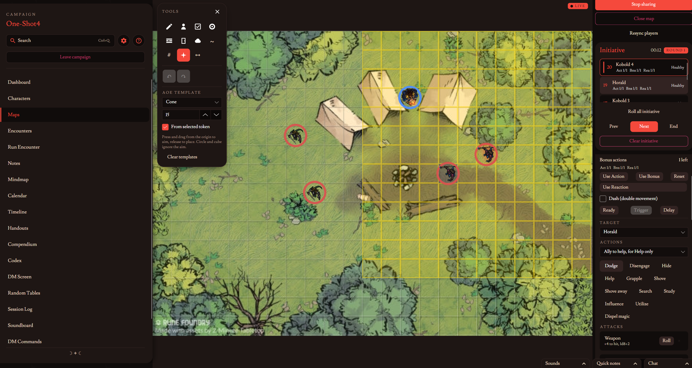
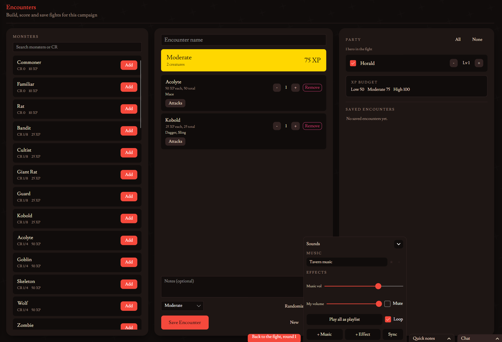
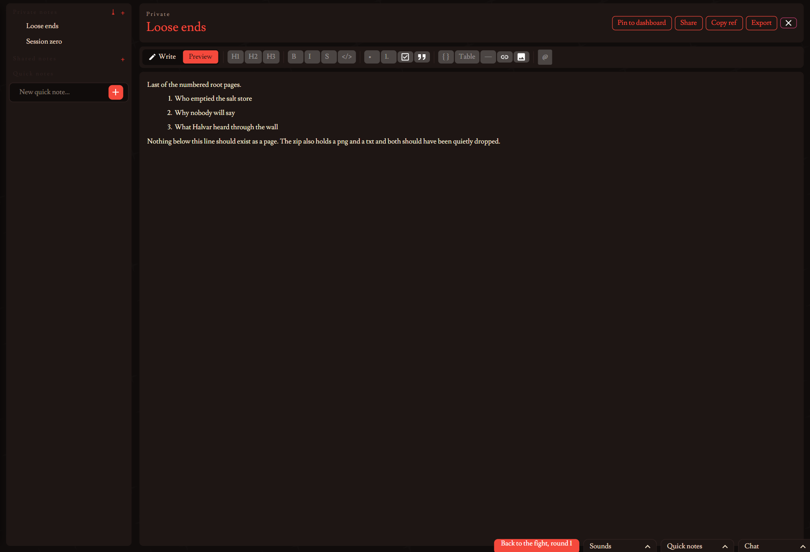
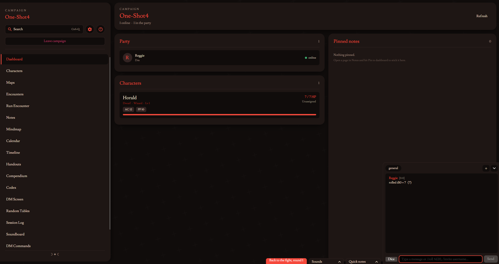

# Dujahit (beta)

### The complete TTRPG toolkit

I started this because I wanted one program for my table instead of five browser tabs and a pile of paper. It is beta and parts of it are rough, but it runs a game.

The rules are not written into the code. They sit in a json template you can open and edit, so the numbers, the conditions, the classes, the spells and the items are all yours to change. Nothing stops you writing a ruleset that has nothing to do with 5e, the core roll can be 2d6 or a dice pool or roll under if that is your game.

### Background

I have worked on this idea since 2017 and since then it has taken many forms, from a very basic python test to a unity build, where I finally about 4 years ago started working on it by using WPF. I had been using WPF at work to make simple apps for industrial usage and found it quite easy and malleable, but one of my friends just recently switched to only using linux so I made a tough choice and started working in Avalonia instead (since I had some experience) to make that cross-platform dream happen.

Now roughly 9 years later we are here and the beta is ready. I cannot thank one of my good friends enough, he will not be named here but helped me a ton in alpha and came up with ideas like the quicknotes. Many thanks go out to him.

### Getting a ruleset

No ruleset ships inside the download, so grab one from the `Templates` folder here and point the app at it the first time you make a campaign.

* `srd_5e_2014_template.json` is the 2014 SRD, classes, spells, monsters and equipment
* `srd_5e_2024_template.json` is the 2024 SRD, still missing its spells
* `template_empty.json` is a blank one to build your own on
* `blank_5e_2014_v1.json` and `blank_5e_2024_v1.json` are the 2014 and 2024 rules chassis with none of the content, so abilities, conditions, damage types, currencies and every combat setting are filled in and the classes, races, items and spells are yours to write

### A note on the installer

Windows will say it does not recognise the publisher, because I have not paid for a signing certificate. Click More info and then Run anyway.

### What is in it

* Maps with tokens you drag around, walls and doors, fog of war, and drawing that everyone sees live
* A combat tracker that actually applies the rules, initiative, conditions that count themselves down, movement budgets, actions and reactions
* Character sheets, and a creator that builds whatever your template says a character is
* Chat with your own custom channels, dms included
* Notes with folders, markdown, and links between pages
* Every bit of the loaded ruleset in one searchable compendium
* Encounter building, a dm screen, handouts, a session log, a calendar and a timeline
* Multiplayer over your own network or support for port forwarding, one host and however many players you want

### What does Dujahit mean?

Dujahit is a word in Umesámi, a near dead language that my people speak. Right now around 100 people can speak it at all, and way closer to 15 or 20 speak it with real fluency.

`dujahit ~ dujasit = to do crafts`

### Fonts

Lusitana, https://www.1001fonts.com/lusitana-font.html

### Support

If you want to support the development for this project to ensure I can make additions and fix bugs, supporting me on Buy me a coffee is greatly appreciated: https://buymeacoffee.com/busterlandstrom

### License

You can use this source code yourself, or fork it and put your own spin on it, credits required. Making a commercial product out of this repo or a fork of it is not allowed.

This work is licensed under the Creative Commons Attribution-NonCommercial 4.0 International License. To view a copy of this license, visit https://creativecommons.org/licenses/by-nc/4.0/
